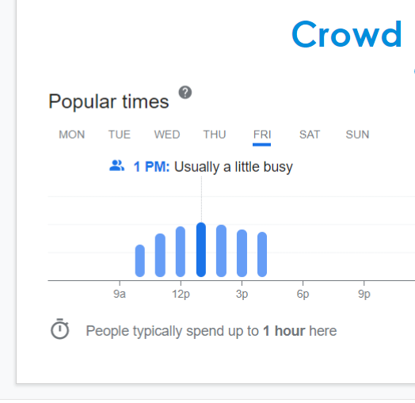

<h1 style="text-align:center;color:#008EDC">Mysuru Application

(DSC WOW Hackathon)</h1>

<h1 style="text-align:center;color:#F2CA25">Team: <span style="color:white">Boolean Bandits </span></h1>

<br/>
Here is a link to our Slides Presentation: https://docs.google.com/presentation/d/1qzqAM1F67dW3OdJR_5ZKCu8kYmC_jTOkwgEZLxZiA5c/edit?usp=sharing

Mysuru Application is design specially for Mysore. It is made under **DSC WOW HACKATHON**. It is made to promote and provide functionality to the Tourism with one stop support.

***
<h1 style="color:#DBD06F">Features </h1>

<h3>1-Simple Features</h3>
<h3>2 -Advance Features </h3>

<br/>

## **1- Simple Features:**

* <span>**Transportation**</span>
  
  * Cab booking suggestions  from Airports,   Stations, etc.

  * Time Saving and easy to book and reach to desire place in Mysuru.


****
<br/>

* **User Review & Tour Making:**
   
   * Visitor Reviews & Expereiences based on Google Reviews 


   * Tourist curated tours based on the Visiting Hours of Sightseeing places, Best places to visit them, Budget   

   


***

## **2 - Advance Features**

  * **Translator:**
     
     * t gets really difficult for tourists to communicate with the natives be it for asking directions, shopping for souvenirs or ordering of food.
 
          This is exactly why tourists require a Translator app on the webpage for their basic end-to-end interactions with fellow Kannadigas.


* **ChatBot:**
    
    * A Support that provide details regarding Mysuru.

    * Query resolver

    * Information Bot


 * **Crowd Indicator:**
   
   
     
     * Crowd level Indicators using Google Live Feed for crowding.

    * Since Covid-19 has taken the world by storm, it is important to obey the social distancing safety norms put forward for our safety.
     Useful to follow  Social Distancing While Travelling


***

## **Future Adding:**
* ### **AR/VR virtual tour.**

***

# How to run project:

**1- Clone the Repository**

**2- Head to the Root Folder**
```
cd DSCWOW_Mysuru
```

**3- Run the Following Command**
```
python manage.py runserver
```


***
   ***
   ***

   **<h2 align="center"> Made by <a href="https://github.com/Rishabhc711/DSCWOW_Boolean-Bandits">Boolean Bandits</a> With 💜. </h2>**

***
***
